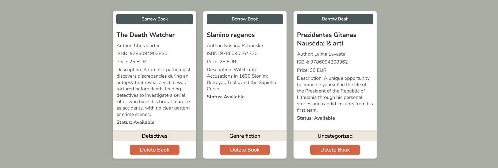
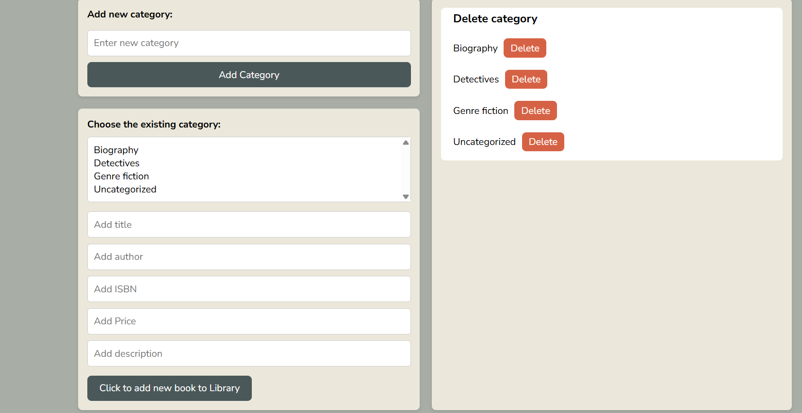
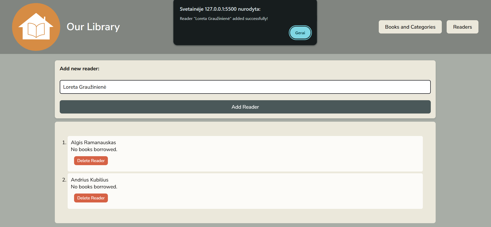
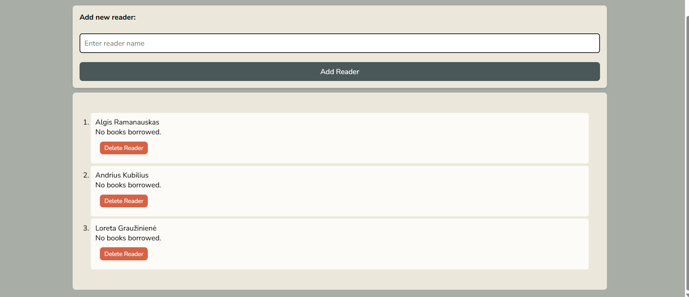
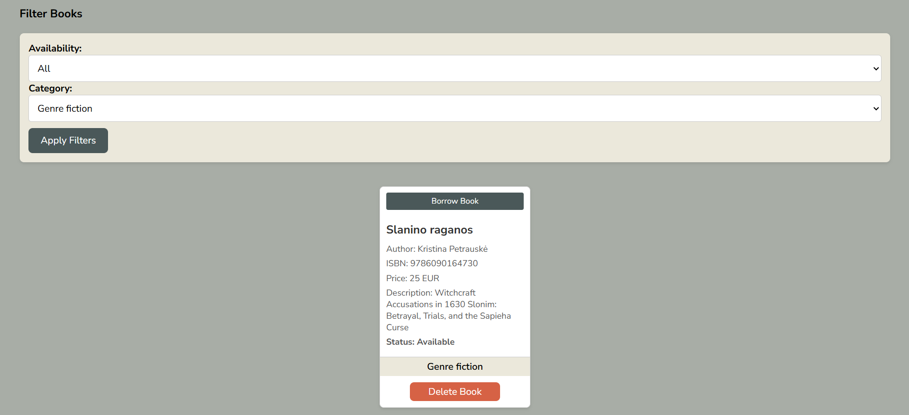

# 📚 Library Management System v 1.0

Welcome to the **Library Management System**! This project allows users to manage books, categories, and readers in a simple, interactive library environment. It includes features for adding, borrowing, returning, and deleting books, along with managing book categories and registered readers.
---
### Version 1.0 note
At this stage all the information the user enters, webapp is saving to local stocage on user's browser. Therefore, to test the app, please enter your categories, book information and reader names.

---

## Features

### 1. **Library Management**  
Manage your library by adding, borrowing, returning, and deleting books. The system allows for efficient book categorization and keeps track of the borrowing status for each book.

  
*Above: The Library Management page showing books and their borrowing status.*

### 2. **Book Categories**  
Books can be organized into different categories (such as Fiction, Biography, etc.), making it easier to browse and filter the books in your library.

  
*Above: Category management section for adding and displaying categories.*

### 3. **Reader Management**  
Readers can be added, and their borrowed books are tracked. You can also delete a reader from the system. Each reader can borrow and return books.

*Above: Reader management page displaying readers and their borrowed books.*

  
  

### 4. **Search & Filter**  
The system allows you to filter books by availability and category. You can easily find available books or books that are currently on loan.

---

## 📖 Functionality

### Book Management

- **Add Books:** You can add new books to your library with details like title, author, ISBN, price, and description.
- **Borrow Books:** Borrow a book by selecting a reader and checking the book's availability.
- **Return Books:** Return a borrowed book and update the system accordingly.
- **Delete Books:** You can delete books from the library system if necessary.

### Categories Management

- **Add new category**
- **Delete existing category** Once the existing category is deleted, all the books from this category get reassigned to 'Uncategorized' category.

### Readers Management

- **Add new reader**
- **Delete existing reader**

---

## Further steps -  notes for version 2
- Implement the user input validation 
- Filter books by author, name, price, ISBN number
- Option to sort books alphabetically by author/name/price in ascending/descending order
- Find reader by name
- Filter readers with the books
- Implement extra security step in order to delete category 'Undefined'/ or not possible to delete
- If the book belongs to Uncategorized', make an option to assign the category
- Do no allow to delete the reader who have books on loan

## 🎉 Project Team 🎉

### The following people worked on this project:

- **[Asta Remeikienė](https://github.com/AstaRem)** 
- **[Robertas Tilūnas](https://github.com/tilrob)** 
- **[Arnas Jankūnas](https://github.com/ArnasJ-git)** 

